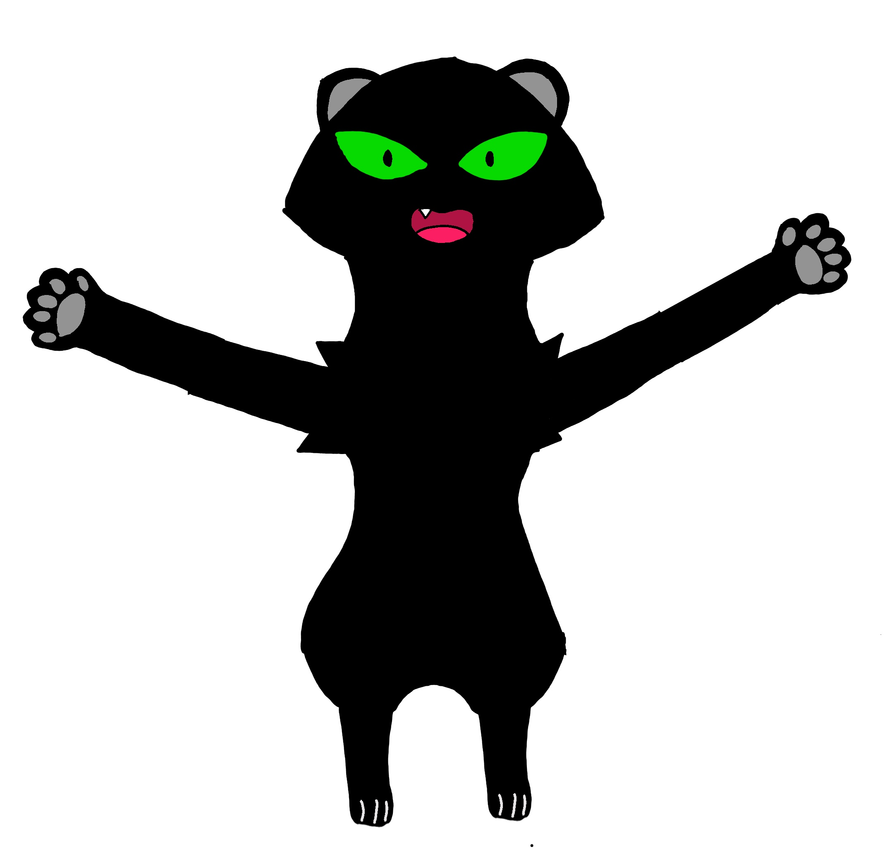

# Пред новой жизнью
## Связывание

### 2
Одним днём Таня приглашает Мао на свидание. 
Таня(Задорно): “Знаешь, (Mittens), с момента последней нашей встречи, я уже говорила что ты изменился. Я подумала, может, давай попробуем ещё раз. Я знаю: мы оба этого хотим”
ММ(неловко): “Да, ты конечно любишь местами нарушать закон, но возобновить наши отношения я согласен.”
“Отлично.  Быстро согласился”

## Серьёзные отношения приводят к серьёзным последствиям
### 1
Очевидно, что Таня рано или поздно будет беременна. Узнает она это из-за задержки цикла. Перед парой встало два вопроса:
    1. Жиличный
    2. Брачный
Второй вопрос был решён быстро. Свадьба была назначена на следующую неделю. Свадьба была по “философии Шевцова”: Оформление скромное, гостей мало(Евгений, Адорабат, Бэйджерклопс, родители с обеих сторон)
В первом вопросе было два выбора: дом Тани и дом Мао, выбор в пользу второго был сделан по двум причинам:
    1. Дом Мао был по площади больше
    2. Мао Мао всё ещё по совести и зарплате был привязан к работе шерифом
На следующий день после свадьбы Таня рассказала БК и АБ о ситуации.
На удивление Тани отреагировали они крайне негативно. Я приведу цитаты обоих:
АБ: «Неееет, я хочу чтобы Мао Мао тренировал только меняяяяя!»
БК: «Мао Мао перестанет проводить со мной время!»
Таня почувствовала себя униженной. «Люди() обычно радуются этому!» и ушла она в спальню хлопнув дверью. Мао понял, что решить вопрос придётся ему.
Мао Мао вроде смог перевести отношение к событию на нейтральное.
Badgerclops сделал спальню для Линь(Чудо на воображаемом японском) Мао.
Вид спальни выходил на pure heart. Половина стены - стекло, Мао считал это довольно опасным, но Badgerclops всем весом разогнался в окно, и оно выдержало. В левом углу стояла бесцветная деревянная кроватка.

## Затишье
### Завершение карьеры тани
Во время очередного нападения Sky pirates Таня почти не успевает отвернуться от удара orangosnakа. Но ММ успевает отвести её от удара.
Мао Мао, придя с ней домой, говорит:
“Таня, я понимаю твоё стремление помогать нам, но ты должна на время оставить геройство, ради нашего сына”.
“Нет, я могла тогда увернутся”.
“Ты ставишь под угрозу не только свою жизнь, но и жизнь Линь”.
“Ладно.”

### Первый удар
На 6-м месяце, в 3 ночи ребёнок впервые толкнулся, Таня быстро положила руку мужа на живот, разбудила его крутив(тряся) его лицо “Эй. Ээээй. Вставай! твой сын толкается!” ММ почувствовал удар почти сразу как проснулся.
“Ого” 
“Ладно, спокойной ночи”
Мао Мао резко лёг с глубокими мыслями о будущем.

### Осознание слабости
Спустя месяц Тане уже было настолько тяжело спускаться, что Мао Мао пришлось самому спускать её. Тогда он с Badgerclops и Adorabat решили что ему с ней надо перехать на низ.
Пока Таня лежала на дивне. Они начали переносить двухместный матрас. Дело это было тяжёлое, но они справились. Матрас лежал почти у стены, на равном расстоянии между диваном и кухней.
Первая такая ночь. 3 часа ночи. Таня проснулась от голода, но ей было не до него.
Таня: "(Шёпотом) Миттенс. (Громче) Миттенс. (не повышая голос, но резко и толкнув его) Миттенс!"
Мао Мао с просоня: "Да! Что такое!?"
Таня: "Можно ты мою голову себе на колени положишь, чтобы я тебе в глаза смотрела?"
Мао Мао: "Ладно". Он переходит на её сторону, которая от стены, подымает её голову, садится и ложит голову, как она сказала, себе на колени и смотрит в её голубые глаза.
Таня: "Когда ты мне 2 месяца назад сказал, что мне пора стать на паузу, я думала что сразу из роддома понесусь ловить преступников. Что беременность на меня никак не повлияет. Но сейчас. Я постоянно хочу есть, даже сейчас, (голос плавно повышает тон) мне настолько тяжело ходить, что вам пришлось перенести матрас на 1 этаж, (начинает плакать) я поправилась на 10 кг. Я даже на бок повернуться не могу! Я себя не человеком чувстую, а свиноматкой какой-то!"
Мао Мао(Вытирает ей слёзы): "Тише. Не надо так о себе. Ты будущая мама. Столько есть это нормально. Ты по сути ешь за себя и малыша".
Таня: "Ты мн

# Новая Жизнь
## Рождение
### New
Характеристика:
* Имя:  Линь(Чудо на имаджинированном японском)
* Фамилия: Мао
* Breed: tanuki
* Цвет кожи(меха): Полностью чёрный
* Цвет глаз: зелёный
(Photo here) 


Ему здесь 5

## Послеродовая Деперссия

### Начало
После рождения Линь, всё пошло не сколько по физической, сколько по моральной наклонной со стороны Мао, ведь Таня её уже прошла. Он думал что сможет и воспитывать сына, и расти как герой. Но его хватало только на сына и одолеть Sky pirates. В результате этого у него медленно, но верно начала проявляться апатия. Он всё чаще и дольше стал появляться в баре. Каждый день бармен спрашивал его: “Всё хорошо?”, “Не очень”. Он его пытался расспросить, но бесполезно.
Однажды Тане это надоело, она забрала его из бара, привезла в лес и спросила:
“Что с тобой?”
“Ничего.”
“А если честно?”
“Ничего!”
“Тогда почему тебя дома нет!”
“Эх. Знаешь. Я…. Я думал, что когда у меня будет ребёнок, я буду героем на уровне моей семьи, моего отца. А по итогу: я справляюсь с пиратами хуже чем тогда.”
“Ну…. Тогда давай спросим у твоего папы как он тебя воспитывал, сестёр.”
“Но. Что он подумает обо мне?”
“А почему ты не подумал, что о тебе думает сын!”
“Да. Ты права.”
“Завтра вечером и поедем.”

### Диалог
На следующий вечер они поехали к родителям Мао. Сына оставили с Badgerclops и Adorabat. Приехали без предупреждения. Отец был дома. Они все сразу после приветствия сели за стол.
“Пап, мы с Таней хотели задать вопрос”.
“Хаха. Давай.”
“А вот, когда я родился, как ты со всем справлялся.”
“Как обычно.”
“А по подробнее?”
“Сразу когда ты родился мне нужно было защитить деревню на юге от великих медведей. Потом, на следующий день (высказывает свой героизм)”
“Это хорошо, но как ты меня воспитывал?”
“А мне некогда было, тебя мама воспитывала”
Пока Мао Мао был немного поникшим, Таня взяла диалог на себя:
“То есть ты как бы абстрактно ушёл за хлебом?”
“Нет! Я же его обеспечивал!”
“Да, но ты отец всё ещё ниже среднего”
“Ниже среднего!?”
“Да. Ниже среднего”.
(Шин) Мао замахивается “открывашкой” на Таню.
“Да как ты смеешь так говорить!”
Мао Мао останавливает его катаной: “Я думал ты не будешь подымать оружие против человека просто оскорбившего тебя! Я был о тебе большего мнения! Я всю жизнь стремился к твоему величию!”
Мао Мао с Таней уезжают.
ММ по дороге не сдерживается и начинает рыдать.
Они останавливаются.
Таня растягивает ремень чтобы обнять мужа.
“Давай может, чтобы объятия были крепче, сядем сзади?” Спросила Таня.
Они молча сели сзади.
Мао ложится ей на колени.
“Я так старался быть так похожим на отца! А он! Всё это время вместо того чтобы быть с Линем, я пытался достичь недостижимого!”
“Ничего. Все мы ошибаемся. Тем более прошлого всего три месяца. Тем более твоё время с сыном уже наверняка превысило твоё с отцом”.
“Почему меня никто не любил!”
И так на протяжении получаса, пока ММ не успокоился.

### Приезд домой
Приехали. Они открывают дверь. Их встречают разорванные шторы, порванные обои, плачущий на полу Badgerclops и уставшая Adorabat на диване.
Таня: “Badgerclops! Что произошло?!”
Badgerclops увидел мокую от живота до колен Таню, и мокрое лицо Мао Мао. Он ответил: “Я просто пытался помыть его!”
“Зачем?, ах ладно, Где Линь?”
(Показывает) "На полке на кухне".
"Мао берёт лестницу, подымается, и видит спящего Линя. Линь просто лежал на спине. Мао Мао аккуратно берёт его за голову и низ тела. И когда Мао Мао прилодил ребёнка к себе, он свёл руки так, что на них лежал Линь. После этого он спустился.
Мао Мао решил пойти на балкон, взглянуть на ночное небо, полное звёзд.
Сев на балконе, там был лёгкий ветер. Мао Мао понял, что Линю будет холодно. Поэтому он снял с себя свой плащ и как смог намотал его на сына. Кожух, который должен быть на шее, свисал снизу. А часть плаща не накрывала Линя и образовывала дыру. Мао Мао согнул эту часть под сына, чтобы его не продуло.
Задумавшись о том, правильно ли он провёл часть своей жизни, у него опять навернулись слёзы.
Все, увидев Мао Мао с Линем на руках на балконе, решили подойти к нему, Badgerclops сел справа, Adorabat стала на его голову, а таня села слева. Таня увидев слёзы спросила:
"Что такое?"
"Да так, о своём"  
"Я же как ни как твоя жена так что рассказывай, не обижу, обещаю".
"Я думаю, что обо мне думают другие(хнык), видя меня в баре каждый день,(тише)что я делал и делаю со своей жизнью(хнык, голос востанавливается) и нужен ли я сейчас кому-нибудь"
Adorabat: "Мао Мао, конечно же ты нужен! Мне к примеру, ты обучаешь меня стать героем!"
Badgerclops: "Да, ты как никак папа, ты нужен Тане и Линю. Я даже не знаю как я этот день пережил"
Таня(Обняв Мао Мао): "Верно, ты хороший папа, просто тебя немного накрыло печалью. Я понимаю, ты хотел быть таким же великим как твой отец, чтобы сын был горд за тебя, для тебя это было дело жизни и смерти, но обстоятельства сказали иначе. Увидев твоего отца я начала больше понимать тебя. Просто помни что мы с Линем(Мао посмотрел на его спящее лицо) тебя всегда, даже без достижений, любим и поможем если надо. Badgerclops, сходи пожалуйста за салфетками."
Badgerclops: "Хорошо."
Badgerclops вернулся с салфетками.
Таня: "Так теперь рассказывайте, что у вас за день произошло".

### Как B&A Линя нянчили
Таня с Мао Мао уехали. Линь оставили с Badgerclops и Adorabat.
Первым делом они решили посмотреть мультики. Один из эпизодов оказался настолько эмоциональным, что Badgerclops в конце рассплакался. Adorabat заметила отсутствие Линя и спросила Badgerclops об этом. Badgerclops посмотрел вокруг комнаты и убедился в её словах. Он резко подорвался искать его. "Линь! Ты где?" спросил Badgerclops. Они с Adorabat искали его всюду: под диваном, на чердаке, в кабинете Мао, на кухне, в унитазе, спальне, но нигде его не было.
Вдруг зазвучала тревога. Badgerclops: "Я на место, а ты пока ищи Линя пока с ним ничего не случилось". "Эй!" -, не успела сказать Adorabat как Badgerclops улетел. Она обиделась на это и хмыкнула, но продолжила поиски Линя.
Badgerclops прибыл на место, замок короля Snugglemagne. Его уже выжидал король и его прислуга. Когда он прибыл на место, король прибежал к нему с криками:
"Ох как хорошо что вы здесь! Мне кажется что в замке завёлся убийца! Возможно он сейчас один из слуг (показывает на слуг)"
Badgerclops: "Такс, хорошо, успокойтесь, что именно произошло?"
Snugglemagne: "Вот значит ходил я по коридору, как вдруг на меня упала люстра!"
Badgerclops: "Могу я посмотреть где это произошло?"
Snugglemagne: "Да". Проводит его в коридор, на место проишествия.
На полу была упавшая люстра. Она была золотая, с висячими белыми кристалами. Кристалы разбились, осколки разбросало на не сильно большое расстояние, зато верхние золотые пластины остались целыми, остальные были погнуты.
Вдруг, сзади упала ещё одна люстра. Они начали с осторжностью ходить, образовывая круг такой, что никто не мог проскочить мимо них. Они прошлись по всем комнатам кроме одной, но ничего не нашли. Последняя комната была зал. Он был с белыми стенами, полом, потолком, арками и балконами. А на полу были фиолетовые ковры. Главным атрибутом зала был трон короля с фиолетовй обивкой а всё не мягкое было сделано из золота. Пока они искали преступника, вдруг кто-то попытался свалить Badgerclops на голову вазу со 2 этажа.

### Приезд домой 2
Badgerclops: "Вот такая вот жесть сегодня была"
Таня: "Да. Денёк у вас был так себе". Таня видит что Мао Мао с печалью закопался в себя.
Таня, решив его поддержать: "Знаешь, когда Линь только родился, я уже привыкла сидеть дома и защищать деревню мне уже не хотелось. Но я делала потому что знала все эти шутки про отцов, которые не знают: в каком ребёнок классе. Я хотела чтобы ты с ним проводил больше времени и не тонул в работе".
Мао Мао: "Правильно сделала. Спасибо. (Заплакал)"
Badgerclops взял салфетку и вытер ему слёзы
Они посмотрели тот самый мультик, пели песни, в общем проводили вместе время до рассвета.
Badgerclops: "Как красиво."
Таня: "Да. Жаль что нам надо будет как-то этот день на ногах отстоять".
Мао Мао посмотрел на часы: "Линь проснётся через 2 часа"

## Шоковая терапия

### 2
Когда Линь Мао было 4 года.  Однажды . Он как обычно, вечером, лёг в кровать.  Папа, как обычно,  сел рядом: рассказать какую-нибудь книжку.
…
“И вот великий Джо завилял своим хвостом.”
“Пап. А вот где твой хвост?”
“Потерял во время приключения”
“А что за приключение?”
(Рассказывает ту самую историю) "И вот камень упал на мой хвост."
(взяв свой хвост и побаиваясь) "И тебе пришлось отрезать его?"
"Да. Мне пришлось взять катану, набрать воздуха, взмахнуть катаной."
"А что ты тогда почувствовал?"
"Было очень больно и много крови. Пока стоял набралась лужа."
"Брр. Страшно."
"Ну, эм, да. Но это тебе пока не грозит. Так что спокойной ночи".
В 3 ночи из комнаты Линя раздаётся крик. Все приходят в его комнату.
Таня: "Что случилось?"
Линь: "Мне приснился страшный сон".
"Что за сон?"
"Типо я сражаюсь с монстрами, и один из них отрезает мне хвост!"
“Окей. Но ведь это всего лишь сон. Так что ложись спать”.
“Можно с вами, а то мне страшно спать одному?”
Мао Мао: “Ладно. Один раз можно”.
Таня язвительно посмотрела на Мао Мао
Линь: “Спасибо!”
Линь даже с ними спал беспокойно. Просыпался ещё 2-ды за ночь
На утро он (очевидно) пошёл в садик. Всё время он был беспокоен за свой хвост. Но пик настал когда все дети вышли на Улицу. Линя позвали играть в футбол, но он отказался так как мог упасть и ему могли наступить на хвост. По той же причине он отказался от игры в догонялки. В конце его позвали кататься на качелях(весах). Он крикнул заплакав: «Хватит! Не хочу!» И убежал в угол. Это заметил воспитатель и спросил его «Почему ты не хочешь ни с кем играть?». (Линь рассказал всё как есть).
Мао Мао позвонил воспитатель:
Мао Мао: «Алло».
Воспитатель: «Добрый день. Нам надо поговорить по поводу вашего сына. Желательно сейчас».
«Что случилось!? С ним все в порядке?!»
«Физически, да. Но вам лучше всетаки придти»
«Хорошо»
Мао Мао прибыл с Таней на место очень быстро.
Они с воспитателем были в коридоре, Линь был в комнате, рисовал и смотрел мультики.
Таня: «Что случилось?»
Воспитатель: «Я не знаю что в вашей семье недавно произошло, но Линь панически боится травмировать свой хвост.»
«Ну. Это нормально. Никто не хочет быть травмирован».
«Но он из-за этого боится играть с детьми».
«Ясно».
Мао Мао: «Ну, я там немного не аккуратно историю рассказал».
Воспитатель: «Понятно. Ну. Я вам дам возможность самим разобраться с этим, но если не сможете, вот контакты психотерапевта».
«Хорошо».
Мао с Таней забрали сына. Пришли домой.
Мао: «Линь, слушай, нам тут воспитатель сказал что ты боишься сделать больно хвосту. Но ведь нельзя ограничивать себя из-за этого. Видишь у меня нет хвоста, но я из-за этого не умер же».
«Но мне страшно то, насколько мне будет больно».
Мао долго молчит пытаясь придумать что-нибудь.
«Но ведь можно что угодно придумать и боятся всего из-за этого».
«И буду»
Таня спустя некоторое время: «Но ведь люди теряют еще более важные вещи и живут с этим. Например нога адорабат или глаз Badgerclops»
«АААААААААА!!!!!!»
Линь быстро пополз в коробку.
Таня: «Линь, выходи»
«Нет»
«Пожалуйста»
«Нет»
Спустя день и трое родственников включая Badgerclops все поняли, что лучше обратиться к психотерапевту 
(Обращение к психотерапевту)
Линь Мао пока приостановил тренировки с родителями. На одном из сеансов Линю сказали попробовать себя вне амплуа своих родителей. Линь решил остановиться на танцах. Ему понравилось. Тренировки Линь восстановил только спустя 3 месяца по предлогом «обороны». Ведь в танцах он видел себя больше, чем героем. 

## Фотография
### New
3. Когда Линь было 6 лет. Евгений решил заняться фотографией. Линя это увлекло. Поэтому он решил тоже заняться этим.

## Поезка в беларусь
### Начало
Семья Мао Понеслась в аэропорт. Ведь Линь исполняет часть своей мечты: путешествие по СНГ(а именно сейчас по Беларуси). Он испытал невероятный восторг при приезде в Аэропорт. Эстетика воздуха восхищала его. Они сориентировались, нашли нужный терминал. Дальше Линь пошёл один. После всех проверок он радостно(как после покупки новой приставки) сел ждать. Через час он наконец дождался «Самолет …-Минск прибыл на (платформу)». Линь быстро стал в очередь на посадку. Сел на специально выбранное у окна место. Через 10 долгих минут, наконец самолет тронулся. Спустя 3 поворота самолет наконец начал разгоняться, взлетать. Линь испытал радость не сравнимую ни с чем возвышаясь над землёй и наблюдая Pure Heart за бортом. Спустя час он уснул. Через 6 часов проснулся. Лететь было ещё 3 часа. Пуньк-пуньк “Уважаемые пассажиры прямо сейчас за бортом 18 градусов по Цельсию. Сейчас мы пролетаем город Москва. До конца полёта осталось: 1 час 30 минут.” Он это очевидно записал чтобы потом отправить родственникам. Пуньк-пуньк “Доброе утро уважаемые пассажиры. Мы сейчас идём на снижение, до посадки осталось 30 минут, просьба пристегнуть ремни, закрыть столики, перевести кресла в стандартное положение и выключить электронные устройства или перевести их в авиарежим”.
Сразу выйдя из аеропорта, Линь заказал такси. Таксит попался общительный. Спрашивал об о всём. Откуда приехал, как семья, не страшно ли одному ехать. Спустя час приехал на место, общежитие школы №1 г. Минска.
Комната его была на 7 этаже. Делил он её с ещё двумя таджиками. Внешность была таджитская, но опрятная(не стереотипная). Встретили они его холодно.

### Случай на кухне
Однажды утром. Настала его очередь готовить завтрак. Пока таджики записывали “кружок”, Линь решил потушить сковородку водой. В результате все струя пламени направилась в потолок задев его лицо.
“Ахахах нахуй”
“Бляяяяяя”
“Ебать”
Линь повернулся к ним
“Ого. Ты вообще не выглядишь горелым”
Линь провёл пальцем по лицу. На месте пальца кожа “Розовела”
“Бляяяяя”
“Ахаххахах”
Линь посмотрелся в зеркало. “Бляяяяяя(На японском)”. Он Пошёл в ванную, помылся. Лицо просто стало розовым, но задняя часть как ничего и не бывало что давало дикий контраст.
“Ебаааать” сказала вся общага
Уже через час ему позвонил по видеозвонку Мао Мао(с ним была Таня)
“Эээээ. Так. Почему мне звонил директор, говорил что ты сжог кухню?”
“Потому что это мммммм правда”
“Как так!”
“Ну я жарил яичницу. Вдруг она начала гореть... Ну я и плеснул воду в сковороду”
(В комнате поднялся жёсткий ржачь)
(Мао Мао жёстко фейспалмнул) “Ээээээх. Ладно. Я ущерб возмещу. Надо как вернёшся научить тебя готовить”
“Окей”
Таня: “Ты лучше не готовь сам, а дай это лучше другим”.
“Хорошо”(За ним повторила вся комната)
Звонок завершился
"Ахахах"
"Иди ты"

## Встеча с дедом
### New
5. Мао с Таней, спустя 13 лет спама от родственников, после месячной поездки в Беларусь, решили отправить Линя деду. ММ провожал сына на поезд со слезами
ММ: “Знай. Если ты почувствуешь себя не комфортно или не нужным, просто позвони нам, мы тебя обязательно заберём”
Линь: “Хорошо. Хорошо.”
Линь крепко обнял Мао и поспешил на поезд. Взял он с собой только игровую консоль и сменное бельё, ведь ехал он всего на 3 дня. Он уже наслушался историй от отца и понимал, что ему ждать.
Спустя 3 часа, Линь приехал в деревню, по дороге его встретила. Ему предстояло взобраться на высокую гору. Спустя час он наконец взобрался. Его встретил старый мужчина в огромном костюме. 
Дед(бассом): “Ну привет, внук. Хохо. Всё же выше своего отца, но всё так же низоват”.
“И тебе привет”.
Дед встал в боевую позу и говорит: “Ну давай я проверю на что ты способен”
“Нет, спасибо”.
“Что значит нет, спасибо?”
“Ну, не герой я”
“А кто тогда?”
“Ну во первых, это идеально тебя показало как отца и деда, во вторых, танцор, фотограф”
“Всмысле танцор!?”
“Ну, танцами занимаюсь, вот недавно сыграли 24-hour cinderela https://youtu.be/Yhe7rcDUTeI?si=TZ1eC761H4fKBv5n”
Они сели за обеденный стол, Мать Мао Мао подала еду.
“Не могу поверить. Так вопрос, как твой танцы смогут защитить твою деревню?”
“Ну я не планирую защищать деревню. Для этого есть папа, мама, Adorabat, Badgerclops”
“А как же ты?”
“А я защищать не хочу. Меня вообще от жестокости воротит”
“Ой да ладно, давай я тебе покажу как надо!”
Дед пошёл в деревню снизу найти угрозу, взяв насильно с собой Линя.
“Такс, где тут у нас угроза.”
Его взгляд остановился на ребёнке подозрительно бравшего что-то из сумки.
“Ага.”
Он набросился на него.
“А ну возвращай что взял!”
Ребёнок испуганно отдал ему леденец.
“Мистер, что вы себе позволяете!”
“Я не дал ему украсть у вас конфету!”
“Это мой сын!”
“Не благодарите”.
(Обращается ко внуку) ”Видишь как я предотвратил ограбление”.
“Нет. Ты просто напал на её сына”
“Ну. Ладно. Давай я тебе ещё пример продемонстрирую”
Дед отправился в пещеру.
В пещере он ударяет стену дабы вызвать монстра.
“Вот видишь. Перед нами огромный монстр. Как твои танцы помогут нам?”
Монстр замахнулся хвостом на Линя. Линь увернулся выгнувшись в мостик.
(Идёт бой)
Дед наносит отрубающий голову удар. Часть крови попадает Линю на лица. Линь мгновенно начинает блевать.
“Хаха. Это было легко”.
Дед поворачивается на Линя. Линь поднимает голову, смотрит на отрубленную голову и начинает опять блевать.
“Так ты настолько чувствителен к крови?”
(Пауза между блеватой)”Да”
“Ну. Тогда мне придётся научить тебя держаться.”. Ставит его перед отрубленной головой. “Смотри до тех пор, пока не перестанет тошинть”.
“Ты ебанулся”. Он попытался уйти. Дед стал на его пути “Нет, ты должен превозмочь отвращение!”. Линь применил способность Тани(уход).
Он ушёл в лес. Он позвонил папе
Мао: “Да?”
“Пап, можно я пожалуйста домой поеду?”
(Нервно)“Конечно можно, что случилось?”
“Ну, дед пытается меня научить быть героем.”
(Перебивая)”И что он сделал?!”
“Ну, сейчас он пытается победить моё отвращение к насилию”.
“О боже мой, конечно езжай домой первым поездом”.
“Хорошо. Пока.” 
Дед издалека: “Линь!”
Линь телепортировался в город. Зашёл в интернет. Только купил билет и дед прилетел, приземлился прямо за него.
Дед увидев заказанный билет: “Вот скажи мне, будет ли общество вос... как ты будешь смотреть в глаза род… будет ли детям приятно тебя вспоминать как танцора?”
Линь бежа собирать вещи и на поезд: “Я не хочу быть героем”
“Всё твоё семейное древо было героями! Даже по матери были хотябы bountyhunter-ами!”
“И что?!”
“Как ты можешь предать род!”
“Почему я просто не могу быть счастливым!”
Линь выгоняет деда из поезда. Вставляет наушники, включает шумодав, включает музыку
Через 3 часа, Линь приехал, домой.
На следующий день опять пришёл дед, уже к ним домой
“Ну дай Мийо Мийо посмотрю как ты тут отцовствуешь”.
Таня: “Говори: зачем пришёл?”
“Я уже ответил на твой вопрос. Такссс, ну что папаша, время на тренировку сына уделяем?”
Мао: “Да. По 2 часа в день минимум”
“Почему так мало?”
“Ну. Ему, как ты знаешь не нравится насилие, мы его обучаем чисто для самообороны”.
“А ты гордишься им?”
“Ну. Конечно.”
“А за что?”
Таня: “Может за танцы, за фотографию, не приходило тебе в голову?”
“Мяо Мяо. Я признаюсь честно, тобой недоволен. Ты оскорбил род воспитанием своего сына”
Линь: “Да я по папе погляжу у нас оскорблять особо нечего”.
“Ну, с вами всё ясно, пойду посмотрю, что там с той мышью, которая с тобой была”.
Линь: “А где живёт она знаешь?”
“Я когда пролетал над деревней видел”
Дед полетел к Adorabat.
“Ну, что, а чего ты добилась за 12 лет?”
Линь: “Не отвечай, он просто хочет тебя унизить!”
“Ну, вот 2 года назад отбила город от дракона”
“А сейчас что?”
Линь: “Не надо!”
“Эм, сейчас воспитываю сына”
“Ага, а тебе сколько, девочка моя?”
Линь(деду): “Стоп”
“18”
“Ага, а что мама не научила
Линь: “Если хочешь драться, так давай!”
“Ха ха ха. Другой разговор.”
“Только в другом месте, чтобы никому не навредить”
“Ой какая неженка. Ладно”.
Они перешли в лес и начали бой.
https://youtu.be/BuQxQMgNYpM?si=4eYPtd-iBZhRv_EP
В результате победил Линь. Деду не понравился исход настолько, что перешёл в свою золотую форму и нанёс удар. Но внук быстро перешёл в золотую форму тоже.
https://youtu.be/VOK4NtCkNGg?si=KNyDv2VqFmtB4K1B
Линь берёт деда за руку. “Ты обидел отца, ты обидел Adorabat, ради того, чтобы я стал героем? Так получай!”
Линь с размаху кидает об землю. Ударная волна была сравнима с бомбой. Все быстро прийшли на место. Мао Мао увидел смотрящего в яму сына. В яме был лишь пепел. Мао Мао был шокирован.
Линь: “Папа, прости!”
Мао Мао(плача): “Нет, этого не может быть! Ты всегда был так силён! Ты не мог умереть так!”
Линь: “Пап, я действительно не хотел”
Все пришли приобнять Мао.

# Линия Adorabat
## Начало
### Начало
Однажды Adorabat становится беременна. Это, очевидно, не самая приятная новость для всех, включая её парня, Макса.
Все вместе они принимают решение идти на Аборт. Но после аборта у неё не будет возможности завести детей. Решение принималось долго по стратегии "Не успеем, значит рожать". Так решение пришло ко второму.

### Общение со стороны родителей Макса
Так как Макс настаивал на аборте, то он не уведомлял своих родителей до последнего. Но момент невозврата настал и было принято решение рассказать его родителям о случившемся.
По приходу к нему домой на Adorabat косым взглядом посмотрел его отец.
Отец был его человеком солидным. Но лицо у него было постоянно не довольное.
Макс с Adorabat синхронно всдохнули и первый сказал: "Мам, пап, нам надо поговорить".
Они сели на кухню, за белый, стеклянный в виде зауглённого прямоугольника. Мама с папой за сели по длинную и широкую сторону соответственно. Макс с Adorabat также.
Макс с ней ещё раз, также синхронно вздохнули.
Макс: "Мам, пап, (быстро) Adorabat беременна!"
Мам и пап: "Что ты сказал?"
Макс: "Adorabat беременна"
Мам и пап: "Ну. Ясно. Значит на аборт надо записаться."
Макс: "Ну, проблема в том, что мы пытались, но нам сказали, что это будет её последний аборт".
Пап: "Ну, может в другой клинике попробуем"
Adorabat: "Ну, уже поздно, да и честно говоря, я не хочу рисковать"
Пап: "Ах так, а просирать свои лучшие годы жизни нахуй можно! Вот знаешь, ненавижу я блять таких людей!"
Мам: "Тише, успокойся"
Пока родители ссорятся Adorabat и Макс решили пойти в его комнату.

### Приживание
Макс: Ну ничего, думают сейас все остынут, и будет нормально. 
Adorabat: Точно?
Макс: Точно!
Они сели принимать решение, где им жить: у Мао, Евгена, Клопса или его родителей.
Сравнив все решения, они приняли решение побыть у его родителей пока Макс, не накопит на первый взонс по ипотеке. Они были богаче остальных, да и Макс чувствовал на себе ответственность, а Adorabat не хотела тревожить Евгена.
Вечер, все уже успокоились, Мама постелила Adorabat постель на кровати в комнате Макса, а Макс перехал на диван.
Мама: "Ну чтож сынок, тебе надо семью обеспечивать, так что на собез приди аккуратным, всё я тебе уже погладила."  
Макс: "Хорошо".
Мама закрыла дверь.
Макс: "Спокойной ночи любимая"
Adorabat: "Тебе также"

### Проблемы
Дома жилось как-то некомфортно. На Adorabat родители смотрели как будто косым взглядом. Но больше всего это проявлялось на отце.
Он постоянно жаловался на неё, то не так приготовит, то не так помоет что-нибудь, говорил что она "Специально залетела ради денег!" и постоянно упоминал что "Ненавидит/нелюбит таких людей!"

### Особый диалог
Однажды, вечером, спустя неделю, дома на кухне был подвыпивший отец, Adorabat пошла туда, и он спросил:
"Слушай, а чего у тебя ноги нету?"
"Да произошла ситуация с матерью".
"Выкладывай".
"Когда мне было 4 года, мы с маой пошли в пещеру за кристалами, в один момент на нас напал дракон. И вобщем то вышила с огрехами только я".
"Ну бля вообще тупо. Как можно в пещере не заметить огромного дракона!"
Макс понял что дело плохо и вышел из комнаты. Как только он прищёл на кухню, он увидел слёзы на лице Adorabat.
Макс и мама: "Ээ, ты чего-то разбушевался!"
Папа: "А ты, Макс, не разбушевался!"
Макс: "Такс, я по лицу Adorabat вижу, что ты её уже достал! Мы собираем вещи и уходим!"  
Папа: "Ну и валите, кому вы там нужны".
Макс и Adorabat собрали вещи и ушли из дома.

### Путь к новому жилищу
Макс зашёл в ближайшую аптеку за успокоительным, но для беременных его не нашлось, поэтому пришлось взять просто воду.
Макс: "На, попей, когда я плакал мне это предлагали и вроде было на грамм легче".
Как только Adorabat закончила пить. Он обнял её слева от неё же. А она спросила:
Adorabat: Где мы теперь будем жить? 
Макс: "У твоего отца".
Adorabat(с сомнением на лице): "Ладно"
Макс:(заметив сомнение): "Чего ты?"
Adorabat: "Модет показаться странно, но когда мы были у тебя я думала, что это логично, ты отец: если и беспокоить родителей, то твоих. А так, что мой то папа сделал?"
Макс: "Я уверен, что он будет чувствовать себя лучше, если тебе будет спокойнее, даже если лишится пары квадратов"
Adorabat: "Я не знаю" 
Макс: "Слушай, ты пережила многое. И увидеть твои слёзы было настоящей жестью. Да и беременным нервничать нельзя. Эх надо было сразу к твоему отцу идти. Прости."
Макс начал гладить её по правой щеке. Но через довольно не большой промежуток времени он остановился с фразой: "Надо привезти тебя к отцу. Он думаю поможет тебя успокоить".

### Новое жилище
Они пришли на порог её дома. Макс звонит в звонок, на часах 19:00. Евгений открыл дверь. На пороге ждали Макс и Adorabat с мокрым лицом. Оба с чемоданами.
Евгений: "Да, Макс, доча, что случилось."  
Макс: "Эх, с отцом поскандалили, я решил что нам лучше пока пожить у вас." 
Евгений: "Окей, окей".
Они заходят домой, садятся на диван в гостинной. Евген слева, Adorabat посередине, Макс справа.
Евгений: "А теперь можно по подробнее?"
Макс: "Ну в общем сегодня вечером Adorabat пошла на кухню. Отец спросил про её ногу, она ответила и, если в кратце, назвал её маму, мягко говоря, глупой".
Евгений: "Ииих, боже мой. Доча, он тебя не обидел?"
Adorabat: "Немного".
Евгений и Макс обняли её.
Евгений: "Я думаю вам пока лучше пожить у меня".
Макс: "(Растянуто) да. Вот только пока может быть дольше, чем вы думаете".
Евгений: "А чего?"
Макс: "Заранее прошу простите меня, но дело всё в том, что это не первая ссора. И я думаю у вас нам будет лучше".
Евгений: "А какая это по счёту уде ссора?"
Макс: "Ну, каждый день по мелкой, может две, думаю, 10"
Евгений: "Ох. Как вы могли вообще там жить, почему, сразу не ко мне?"
Adorabat: "Просто, к тёще зять относился не лучше. А он всё время так жил, так что прости его".
Макс посмотрел на лицо Adorabat. Оно было всё таким же грустным.
Макс: "Слушайте, а вы не знаете, есть ли успокоительные для беременных?"
Adorabat: "Не надо!"
Макс: "Слушай. Я понимаю, когда печально, хочется чтобы все отстали, потому что думаешь, что это признак слабости. Но мы все всё равно тебя считаем сильной девушкой".
Макс обнял её одновременно с этим поместив перед собою. То есть обнял как обычно.
Макс: "Ну. Возращаясь к вопросу."
Евгений: "Ах, да. Никогда не приходилось встречаться с такой проблемой. А ты только в одной аптеке был?"
Макс: "Да".
Евгений: "Ну, я бы тебя ещё посмотреть отправил, но я думаю, что здесь ты прямо сейчас очень, очень нужен".
Макс: "Спасибо. Только где у вас тут есть двуспальная кровать?".
Евгений: "Ну, только в моей, но вам она нужнее".
Макс: "Спасибо. Так приятно с вашей стороны. Можно мы уеденимся?"
Евгений: "Конечно, конечно."
Макс и Adorabat перестали обниматся чтобы пойти в их новую комнату.

### Новая комната

## Роды
### Рождение
Роды прошли мягко сказать не очень. Нижняя чавсть тела выглядела так, будто из неё вылез чужой. Данный факт подтверждали широкие глаза семьи Мао (А Линь даже пару раз стошнило).
Ребёнка назвали Marble. Летучая мышь. Белый с голубыми глазами. На животе изображена звезда. 
Макс хотел взять его, но его куда-то забрали.
Adorabat уже оклемалась. Спустя пол-часа его наконец принесли назад и отдали Максу. Белая мышька была завёрнута в белую пелёнку. Макс, уже папа, не мог не насмотреться с лёгкой улыбкой на большие закрытые глаза вместе с открытым ртом, местами отводя взгляд рассмотреть большие как глаза уши. У Макса лёгенько тряслись руки, будто держал новый телефон.
Adorabat: "Дай посмотреть!"
Макс наклонился и пережал ей в руки белый овал.
Adorabat тоже умильнулась. Спустя время она решила погладить ему сзади голову, переходя на уши.

# Возрождение Сонары
## Великая Помощь(Бабка)
Однажды в деревне Линь увидел сумашедшую бабку, которая постоянно просилась домой. Пока все пытались пройти мимо неё Линь решился спросить

## Великая помощь(зверь)
Однажды Линь гулял, по Pure Heart Valley с другом Джеком, инвалидом (парализованы ноги). 
Они услышали как в кафе ворвался детёныш дракона. Линь пошёл выяснять что случилось. Внутри белый как Marble маленький дракон будто нападал на касира, но Линь понял, что на самом деле он хотел мёда, что стоял за прилавком.
Линь взял мёд с прилавка, оплатил, открыл и дал дракону.
Кассир: "А как же возместить ущерб?"
Линь: "Страховая фирма пускай возместит".
Линь взял дракона и пошёл к другу.
Друг: "И чё, домой его возвращть будем?"
Линь: "Да."
Друг: "Ох. Куда хоть?"
Линь: "Мне папа говорил что на западе от сердца(он показал направление, зная, что Джек не знает где запад) есть на вершине горы гнездо драконов."
Друг: "То есть ты боишься потерять хвост в драке, но полезть на вершину горы с человеком у которого не работает пол тела и драконом тебе нормально?"
Линь: "Ну в горах нет мечей, да и я не говорил что пойду с тобой"  
Друг: "Жесть логика, но ты пойдёшь со мной"
Линь: "Да"
И началось у них великое микро-приключение.

## Приключение

